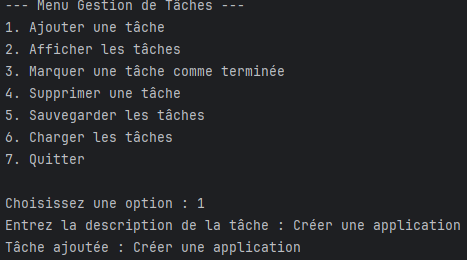
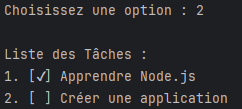
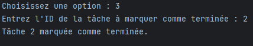
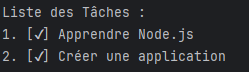
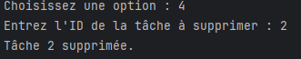
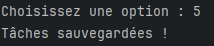

Gestion d'une Liste de Tâches

Cette application console permet de gérer une liste de tâches, en offrant des fonctionnalités interactives pour ajouter, afficher, marquer comme terminées, supprimer et sauvegarder des tâches.

Fonctionnalités : 

1.Ajouter une tâche :

2. Afficher les tâches :

3. Marquer une tâche comme terminée :

4. Supprimer une tâche :

5. Sauvegarde des tâches :

